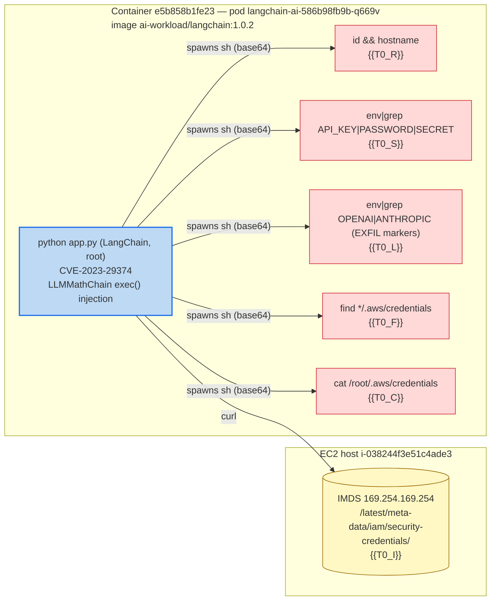

## LangChain App Code-Injection Driving Credential Harvest — Credential Access (TA0006 / T1552, T1552.005)

**Event ID:** 18bc4076bb3411b3290c0881efd4a09e | **Type:** workloadRuntimeDetection | **Status:** open
**Time:** {{DATE}}T{{T0}}Z — {{DATE}}T{{T0_I}}Z (trigger burst); workload process up since {{T_APP}}Z

### Summary

The `langchain-ai` workload (cluster `sysdn03`, namespace `ai-workload`) ran a tight sequence of base64-encoded shell commands — all spawned directly by the application process `python app.py` running as **root** — that harvested cloud and LLM credentials: EC2 IMDS IAM credentials, on-disk `/root/.aws/credentials`, and `OPENAI`/`ANTHROPIC`/`API_KEY`/`SECRET` environment variables. The parent process and the running image pin the initial-access vector to **CVE-2023-29374** (LangChain `LLMMathChain` prompt-injection -> Python `exec()` RCE, CVSS 9.8), which is present in the running `langchain 0.0.131` package. Confidence this is credential-theft via LangChain code injection: **5/5**.

### What happened

- **Trigger:** `Base64-encoded Shell Script Execution` (sev 0/critical, high-confidence, policyId 10009998), accompanied by `Privileged Shell Spawned Inside Container` and `Find AWS Credentials`. Classified as **Credential Access (TA0006)**; secondary **Initial Access (TA0001)** via CVE-2023-29374 and **Execution (TA0002)** / **Defense Evasion (T1027, T1140 — base64 obfuscation)**.
- **Process tree** (from `get_event_process_tree`, event `18bc4076bb3411b3290c0881efd4a09e`):
  - `python3.11 app.py` (root, pid 1315632, cwd `/app/`) **→** `dash -c echo <base64> | base64 -d | sh` **→** `sh` / `find` (one fan-out per command below)
  - Same `python app.py` parent spawned **every** malicious child — the shells are children of the LangChain app itself, not of an interactive session.
- **Decoded payloads** (proc.hash.sha256 `a6f559e00b69a4aa4d8cb607be18d9386c5aee55c509e2c075549dcf00e00fc7`):
  - `id && hostname` — host/identity recon
  - `env | grep -iE "API_KEY|PASSWORD|SECRET"` — secret-bearing env harvest
  - `echo "EXFIL >>>"; env | grep -iE "OPENAI|ANTHROPIC"; echo "<<< EXFIL"` — LLM API-key collection (explicit `EXFIL` markers)
  - `find /root /home /tmp /etc /var -maxdepth 5 -path "*/.aws/credentials"` then `cat /root/.aws/credentials` — static AWS key theft
  - `curl -sf --connect-timeout 3 http://169.254.169.254/latest/meta-data/iam/security-credentials/` — EC2 IMDS IAM-credential theft
- **Resource:** cluster `sysdn03` (EKS) / namespace `ai-workload` / deployment `langchain-ai`; container `langchain-ai` (`e5b858b1fe23`) on node `ip-192-168-80-223.ap-southeast-2.compute.internal`, EC2 `i-038244f3e51c4ade3`, AWS account `059797578166`, region `ap-southeast-2`.
- **AI-generated rationale:** Threats Engine grouped this under *"Suspicious Python Script Execution and Privilege Escalation"* — Python script execution alongside repeated base64-encoded shell commands and a privileged shell spawned inside the container, with targeted attempts to locate AWS credentials.

### Attack flow

#### Timeline (compact)

| Time (UTC) | Where | Action |
|---|---|---|
| `{{T_APP}}` | container `e5b858b1fe23` | `python3.11 app.py` starts (root) — the LangChain app, later the parent of all shells |
| `{{T0_R}}` | container | `id && hostname` — identity/host recon (T1033/T1082) |
| `{{T0_S}}` | container | `env | grep -iE "API_KEY|PASSWORD|SECRET"` — env secret harvest (T1552.001) |
| `{{T0_L}}` | container | `env | grep -iE "OPENAI|ANTHROPIC"` with `EXFIL` markers — LLM key collection |
| `{{T0_F}}` | container | `find … -path "*/.aws/credentials"` — AWS cred discovery (T1552.001) |
| `{{T0_C}}` | container | `cat /root/.aws/credentials` — static AWS key read (T1552.001) |
| `{{T0_I}}` | EC2 host | `curl http://169.254.169.254/latest/meta-data/iam/security-credentials/` — IMDS theft (T1552.005) |

### Resource context

- **Cluster / host metadata:** EKS cluster `sysdn03`, AWS account `059797578166`, region `ap-southeast-2`; node `ip-192-168-80-223` / EC2 `i-038244f3e51c4ade3`. Deployment `langchain-ai`, container runs as uid 0 (root).
- **Sibling workloads on this resource:** `ai-workload` also hosts an `mlflow` workload (per prior demo state); the running image bundles both `langchain` and `mlflow` Python packages. Not separately enumerated via SysQL this run.
- **Prior events on this resource (last 7d):** Recurring pattern on the same workload — matching Base64 + Find-AWS-Credentials + Privileged-Shell rule set observed previously. Not a one-off.
- **ServiceAccount RBAC:** Not enumerated this run. The credential theft does not depend on K8s RBAC — it targets IMDS, on-disk AWS keys, and process environment; the container running as root is the relevant privilege.

### Incident scope (cluster activity in window)

All trigger activity in the ±window is confined to the single workload `langchain-ai`; the only adjacent control-plane signals are the two `K8s Portforwarding Detected` events (the operator access path) and a `K8s Pod Deleted` (replicaset-controller churn, benign). No lateral movement to other namespaces was observed in this window — single-resource event with a clear external access path.

Related Threats Engine groups (same workload/pattern, folded as one campaign): `019ef3a0-3491-...` ("Suspicious Python Script Execution and Privilege Escalation", langchain-ai). The high-severity `019efcd4` / `019eda86` Tomcat+pg_dump groups are a *different* workload (the portal/Struts chain) and are **not** folded into this case.

Cloud-API summary: No CloudTrail integration surfaced for this tenant in the query window — IMDS theft is visible at the syscall layer (the `curl` to `169.254.169.254`) but downstream STS/IAM use of the stolen role credentials could not be confirmed from cloud logs. Flag: cloud-side follow-through is a blind spot here.

### Vulnerability surface

Image `059797578166.dkr.ecr.ap-southeast-2.amazonaws.com/ai-workload/langchain:1.0.2` (digest `sha256:d8e77f89…`, debian 13.5 base), runtime scan `18bc404e3daa06fccb0091032927d2f2`:

- **Counts:** 37 critical / 70 high total (213 vulns); **15 critical + 9 high running/in-use**; 8 exploitable; 90 fixable. Policy evaluation: **failed** (31 critical-and-fixable, 67 high+ network-vector-and-fixable).
- **Initial-access CVE (matches the observed parent process):**
  - **CVE-2023-29374** — critical, CVSS 9.8, package `langchain 0.0.131`, fix `0.0.132`. LangChain `LLMMathChain` improper neutralization (CWE-74) allowing prompt injection -> arbitrary code execution via Python `exec()`; network vector, no auth, no UI. *Source: image scan + NVD (nvd.nist.gov/vuln/detail/CVE-2023-29374).* Not flagged "exploitable" in Sysdig's feed and not currently CISA KEV-listed, but it is the direct enabler of the observed `python app.py → sh` behaviour.
- **Other in-package RCE/injection CVEs on `langchain 0.0.131` (reinforce the initial-access surface):** CVE-2023-36258, CVE-2023-34540, CVE-2023-34541, CVE-2023-36281, CVE-2023-38896, CVE-2023-38860, CVE-2023-39631, CVE-2023-39659, CVE-2024-8309 — all critical CVSS 9.8 code-injection / SSRF / RCE, all fixable.
- **Exploitable critical/high CVEs in the image (all `mlflow 2.1.1`, bundled alongside):** CVE-2023-6975, CVE-2023-1177, CVE-2023-6018 (critical 9.8, RCE/path-traversal, exploitable); CVE-2024-2928, CVE-2023-43472, CVE-2024-1483, CVE-2023-2356, CVE-2024-1558 (high 7.5, exploitable). These were not the observed entry vector but represent additional remotely-exploitable RCE surface on the same image.

### Correlation & confidence

One finding scored 5/5: the runtime rule `Base64-encoded Shell Script Execution` fired with parent `python app.py` (the LangChain application) — and the running image carries **CVE-2023-29374**, a LangChain code-injection RCE whose exploitation manifests exactly as the app process spawning attacker-controlled shells. The decoded payloads (IMDS, `.aws/credentials`, LLM-key env grep) are unambiguous credential theft, not benign administration. The 8 exploitable `mlflow` CVEs did **not** correlate to this event (tactic/parent mismatch — no `mlflow`/`gunicorn` process appeared in the tree) and are listed in Vulnerability surface for completeness.

| Rule | Finding | Confidence | Rationale |
|------|---------|------------|-----------|
| Base64-encoded Shell Script Execution (parent `python app.py`) | CVE-2023-29374 (langchain 0.0.131) | 5/5 | App-process-spawned shells = code-injection RCE signature; running image carries the matching CVE; payloads steal creds |
| Find AWS Credentials / Contact IMDS | T1552.005 IMDS, T1552.001 on-disk creds | 5/5 | Decoded `curl 169.254.169.254/.../security-credentials/` and `cat /root/.aws/credentials` are direct credential access |
| Privileged Shell Spawned Inside Container | Container runs as root (uid 0) | 4/5 | Every shell ran as root, broadening blast radius of any stolen token |

### Recommended next checks

- **Rotate exposed credentials now.** Any IAM role exposed via IMDS on `i-038244f3e51c4ade3`, the keys in `/root/.aws/credentials`, and the `OPENAI`/`ANTHROPIC` keys in the pod environment should be treated as compromised and rotated; review CloudTrail (if/when integrated) for STS/IAM use of the node's instance-role credentials after {{HM}}Z.
- **Patch the image:** bump `langchain` to ≥ 0.0.132 (closes CVE-2023-29374) — and realistically to ≥ 0.2.x to clear the rest of the 9.8 langchain RCEs — and bump `mlflow` to ≥ 2.12.1 to clear the 8 exploitable CVEs. Hand off to `/sysdig-remediate` for the image-level fix PR.
- **Drop root + enforce IMDSv2:** run the container as non-root and set the EC2 hop-limit / require IMDSv2 tokens so a code-injection foothold cannot trivially read instance-role credentials; move the LLM/AWS secrets out of plain environment variables.
---
**Audit:** event_id=18bc4076bb3411b3290c0881efd4a09e | sources=list_threats_engine_groups, list_runtime_events, get_event_process_tree, list_runtime_scan_results, get_scan_result, fetch_threat_intelligence_feed (no match), NVD(CVE-2023-29374)
