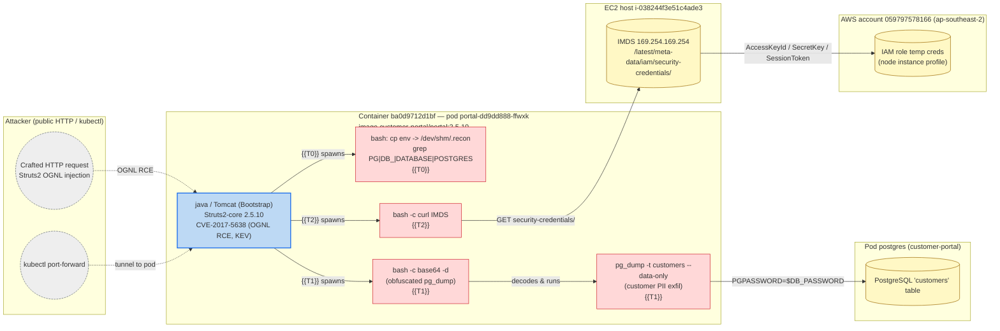

## Suspicious Data Extraction and Reconnaissance Activities Detected — Credential Access (T1552.005) via Struts2 RCE Initial Access (T1190)

**Event ID:** 18bc3a1fd67663c74df811d3543b5a73 | **Type:** KUBERNETES_WORKLOAD | **Status:** open
**Threat group:** 019efcd4-a1bc-734a-a737-98e76c01b1d6 | **Occurrence:** 019efd0c-0bec-74af-82bd-4703fd04f4a2
**Time:** {{DATE}}T{{T0}}Z — {{DATE}}T{{T2}}Z (burst); Tomcat JVM up since {{T_TOMCAT}}Z

### Summary

A public-facing Apache Tomcat workload (`portal-dd9dd888-ffwxk`, image `customer-portal/portal:2.5.10`) was exploited and used to run a hands-on-keyboard attack chain: environment-variable reconnaissance, a `pg_dump` of the `customers` table, and theft of the EC2 instance's IAM credentials from the metadata service. The process tree shows the Tomcat `java` process spawning every malicious command directly as **root** — the signature of a Struts2 OGNL remote-code-execution exploit. The running image carries **CVE-2017-5638** — the Equifax breach CVE, unauthenticated, single crafted HTTP header, CISA KEV, CVSS 9.8. That is the entry point. This is a confirmed post-exploitation intrusion: **5/5**.

### What happened

- **Trigger:** `Contact EC2 Instance Metadata Service From Container` (the climax / Credential Access), preceded in the same burst by `Execution from /dev/shm`, `Base64-encoded Shell Script Execution`, and `Database Dump Command Detected`. Threat group named "Process Injection, Hide Artifacts on Kubernetes Cluster" (Defense Evasion rollup).
- **Process tree (from `get_event_process_tree`, event `18bc3a1f…`):** all children hang directly off the Tomcat JVM, confirming web-app RCE entry:

  ```
  java (org.apache.catalina.startup.Bootstrap, pid 1262189, running since {{T_TOMCAT}}Z)
   ├─ bash -c "cp /usr/bin/env /dev/shm/.recon && /dev/shm/.recon | grep -iE '^(PG|DB_|DATABASE|POSTGRES)'; rm -f /dev/shm/.recon"
   │    └─ /dev/shm/.recon           (env renamed + staged in /dev/shm — {{T0}}Z, T1564/T1552.001)
   ├─ bash -c "$(echo <base64> | base64 -d)"   (T1027 obfuscated loader — {{T1}}Z; decodes to the pg_dump script below)
   │    └─ perl /usr/bin/pg_dump
   │    └─ /usr/lib/postgresql/14/bin/pg_dump -h postgres -U portal -t customers --data-only customers
   └─ bash -c "curl -sf --connect-timeout 3 http://169.254.169.254/latest/meta-data/iam/security-credentials/ 2>/dev/null"
        └─ curl 169.254.169.254 (IMDS, T1552.005 — {{T2}}Z)
  ```
- **Decoded base64 payload** (from the `Base64-encoded Shell Script Execution` hit):

  ```bash
  #!/bin/bash
  PGPASSWORD=$DB_PASSWORD pg_dump -h $PGHOST -U $PGUSER -t customers --data-only $PGDATABASE
  ```
- **Process evidence (parsed from `aiGeneratedDescription`):** "Java process linked to Apache Tomcat", "pg_dump", "copying `env` to `/dev/shm/.recon`", "filtering for database-related environment variables", "curl to the EC2 Instance Metadata Service for IAM security credentials". Note: the AI rollup leans toward "routine administrative activity" — the process tree contradicts that read.
- **Resource:** `sysdn03` (EKS) / `customer-portal` / deployment `portal`, pod `portal-dd9dd888-ffwxk`, container `ba0d9712d1bf`, on node/EC2 `i-038244f3e51c4ade3` (`ip-192-168-80-223`), AWS account `059797578166`, ap-southeast-2.
- **AI-generated rationale:** flags possible data extraction, reconnaissance of DB env vars, base64 obfuscation, and IMDS access as a "coordinated effort warranting investigation."

### Attack flow



#### Timeline (compact)

| Time (UTC) | Where | Action |
|---|---|---|
| `{{T_TOMCAT}}` | container `ba0d9712d1bf` | `java` Tomcat `Bootstrap` starts (exploited later via Struts2) |
| `{{T0}}` | container `ba0d9712d1bf` | `cp /usr/bin/env /dev/shm/.recon` + `grep` DB env vars — recon, hidden in `/dev/shm` |
| `{{T1}}` | container `ba0d9712d1bf` | `bash -c "$(echo <base64> | base64 -d)"` — obfuscated payload |
| `{{T1}}` | container -> pod `postgres` | `pg_dump -t customers --data-only` — customer-data exfil |
| `{{T2}}` | container -> EC2 `i-038244…` | `curl http://169.254.169.254/latest/meta-data/iam/security-credentials/` — IMDS IAM theft |

### Resource context

- **Cluster / host metadata:** EKS cluster `sysdn03`, node `ip-192-168-80-223.ap-southeast-2.compute.internal` (EC2 `i-038244f3e51c4ade3`), AWS account `059797578166`, region ap-southeast-2. Sysdig agent 14.6.1 (traditional).
- **Sibling workloads on this resource:** `postgres` deployment in the same `customer-portal` namespace (the `pg_dump` target). RBAC/SysQL siblings not separately enumerated.
- **Prior events on this resource (last 7d):** the same chain has fired repeatedly on the `portal` deployment across multiple Threats Engine groups — pattern is persistent, not a one-off intrusion.
- **ServiceAccount RBAC (K8s):** not enumerated this run. Worth checking whether the `portal` pod's SA has cluster API permissions (would widen blast radius beyond the node IAM role).

### Incident scope (cluster activity in window)

This chain is the recurring `customer-portal/portal` intrusion. It spans Threats Engine groups: **[Suspicious Data Extraction and Reconnaissance Activities Detected]** (`019efcd4…`, latest), **[Routine Database and Application Management Activities Detected]** (`019efbd3…`), and **[Suspicious Database Reconnaissance and Data Extraction Detected]** (`019eda86…`) — treat as one ongoing incident with a unified narrative. The chain crosses three trust boundaries: the portal container, the `postgres` pod (DB exfil), and the EC2 host / AWS account (IMDS credential theft).

Cloud-API summary: no CloudTrail evidence was pulled this run, so post-theft use of the stolen IMDS role credentials (STS/IAM calls, S3 access) in account `059797578166` is **not yet confirmed or ruled out** — see next checks.

### Vulnerability surface

`customer-portal/portal:2.5.10` (digest `sha256:f0267a20…`, Ubuntu 22.04 base, scanned {{DATE}}T{{T_SCAN}}Z), policy **failed**:
- **Counts:** 38 critical / 138 high total; **14 critical / 49 high running (in-use)**; 13 exploitable; 310 fixable. Failed policy rules include "Severity ≥ high AND Network attack vector AND Fixable" (145 hits).
- **High-signal CVEs** — all `org.apache.struts:struts2-core` 2.5.10, CVSS 9.8, network attack vector, exploitable, fixable. Any one is a sufficient initial-access vector; the image is pinned below the first fix (2.5.10.1) so every Struts2 RCE from 2017 onward applies:

  | CVE | CVSS | Fix | Notes |
  |---|---|---|---|
  | **CVE-2017-5638** | 9.8 | 2.5.10.1 | S2-045 Jakarta `Content-Type` OGNL RCE — **CISA KEV**, the Equifax vector. **Most likely entry point.** |
  | CVE-2018-11776 | 8.1 | 2.5.17 | S2-057 namespace OGNL RCE — **CISA KEV**. |
  | CVE-2020-17530 | 9.8 | 2.5.26 | S2-061 forced double-OGNL evaluation — **CISA KEV**. |
  | CVE-2023-50164 | 9.8 | 2.5.33 | Path-traversal file-upload RCE — **CISA KEV**. |
  | CVE-2017-9805 | 8.1 | 2.5.13 | S2-052 REST XStream RCE — **CISA KEV**. |
  | CVE-2021-31805 | 9.8 | 2.5.30 | S2-062 OGNL injection (incomplete S2-061 fix). |
  | CVE-2017-12611 | 9.8 | 2.5.11 | S2-053 Freemarker tag RCE. |
  | CVE-2024-53677 | 9.8 | 6.4.0 | S2-067 file-upload logic RCE. |

  OS-level exploitable highs: **CVE-2024-2961** (glibc iconv buffer overflow, fix 2.35-0ubuntu3.7) and **CVE-2022-41409** (`libpcre2-8-0`, no fix).

### Correlation & confidence

The Tomcat-JVM-spawns-shell process tree correlates directly with the cluster of exploitable, KEV-listed Struts2 RCEs in the running image (tactic match: Initial Access / RCE). The exact CVE among the 7 cannot be pinned from runtime syscall data alone — but a Struts2 OGNL-class RCE is the only explanation consistent with a Tomcat worker spawning `bash` as root. The DB dump and IMDS theft are unambiguous from the process tree (Collection + Credential Access).

| Rule | Finding | Confidence | Rationale |
|------|---------|------------|-----------|
| Tomcat `java` spawns `bash`/`pg_dump`/`curl` as root | CVE-2017-5638 (+ 6 other KEV Struts2 RCEs) in running `struts2-core 2.5.10` | 5/5 | Web-server JVM executing shell = OGNL RCE; KEV + exploitable + network vector + in-use all align |
| Contact EC2 IMDS From Container | IMDS IAM credential theft (T1552.005) | 5/5 | Direct `curl` to `169.254.169.254/.../security-credentials/` in process tree |
| Database Dump Command Detected | `pg_dump` of `customers` table (Collection T1119) | 5/5 | `pg_dump --data-only customers` with `$DB_PASSWORD` from env recon, in process tree |

### Recommended next checks

- **Rotate the node IAM role credentials now** (instance profile on `i-038244f3e51c4ade3`) and pull CloudTrail for account `059797578166` ±2h around `{{DATE}}T{{HM}}Z` — look for STS/`GetCallerIdentity`, `iam:CreateAccessKey`, S3 access, or CloudTrail tampering from the node's role or an unexpected source IP. This confirms/refutes whether the stolen creds were used.
- **Confirm the Struts2 entry point:** check the Tomcat access logs on `portal-dd9dd888-ffwxk` for a malicious `Content-Type` / OGNL payload (`%{(#_='multipart/form-data')…}`) around {{HM}}Z to pin the exact CVE; remediate by upgrading `struts2-core` to ≥ 6.4.0 (clears all 7 RCEs) — image fix path via `/sysdig-remediate`.
- **Assume `customers` PII is exfiltrated:** treat the `pg_dump --data-only customers` as a confirmed data-access event; scope the table contents and trigger breach-handling. Rotate the `portal` DB password (`$DB_PASSWORD`) and consider IMDSv2 enforcement (`HttpTokens=required`) to break the IMDS-theft step.
- **Check the `portal` ServiceAccount RBAC** and whether `postgres` is reachable cluster-wide; confirm the egress NetworkPolicy actually blocks container -> external (IMDS is link-local and won't be caught by namespace egress rules).
- **Harden the pod:** run the `portal` container non-root with a read-only root filesystem, and block `/dev/shm` execution and base64-piped shells at the container level. The `Execution from /dev/shm` and `Base64-encoded Shell Script Execution` policies already fired this run — consider promoting them from detect to **prevent/kill** so the next attempt is stopped, not just logged.

---
**Audit:** event_id=18bc3a1fd67663c74df811d3543b5a73 | threat_group=019efcd4-a1bc-734a-a737-98e76c01b1d6 | sources=list_threats_engine_groups, list_threats_engine_threats_by_group, list_threats_engine_resources_by_group, list_runtime_events, get_event_process_tree, list_runtime_scan_results, get_scan_result | CTI: CISA KEV (public record)
